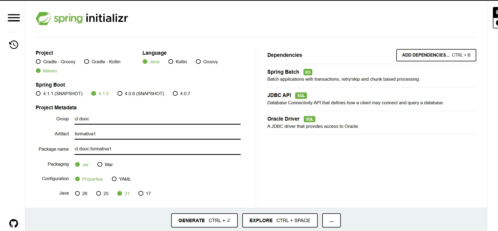
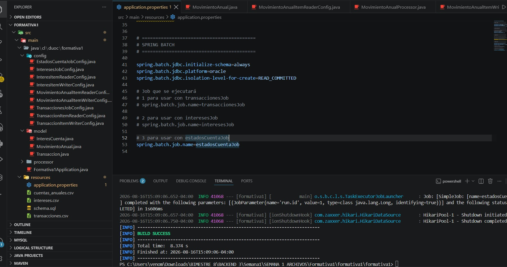
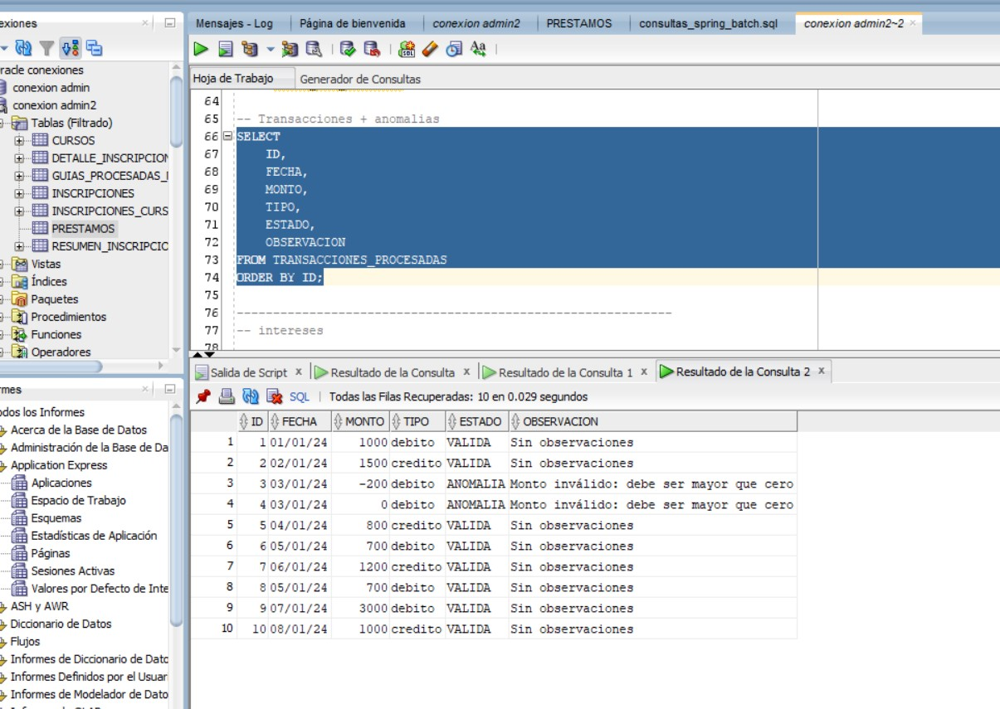
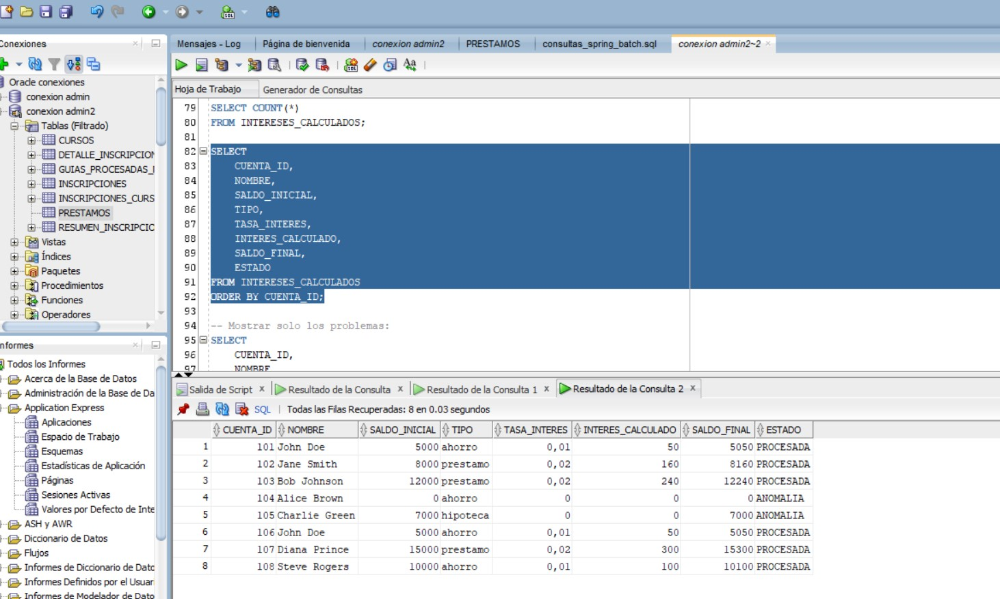
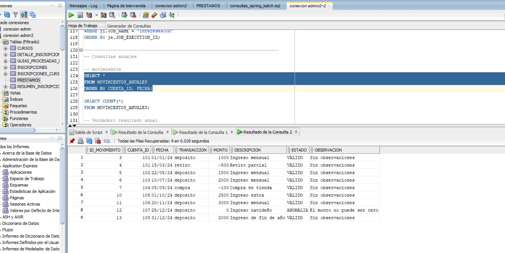
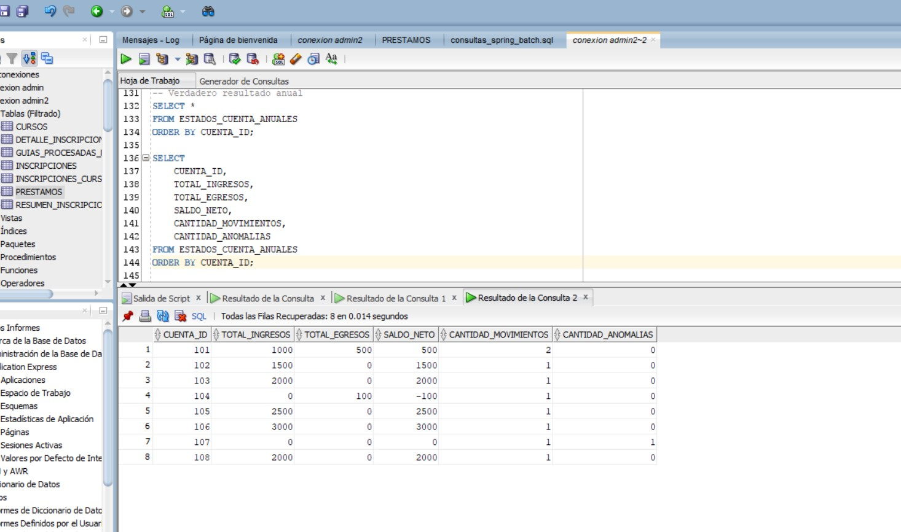
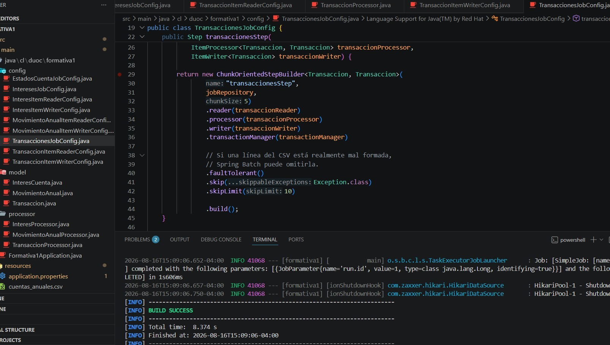
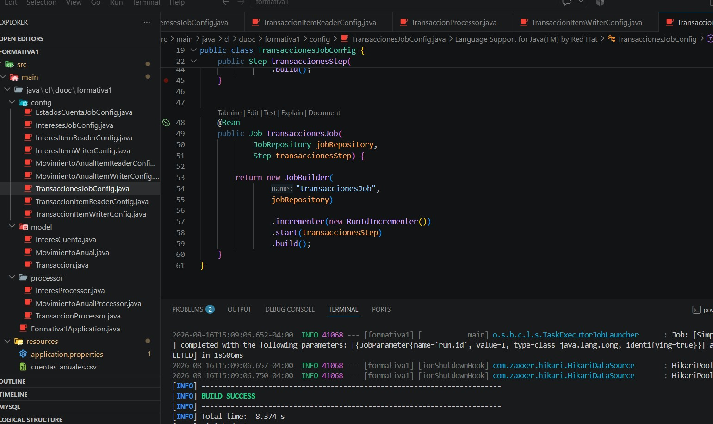
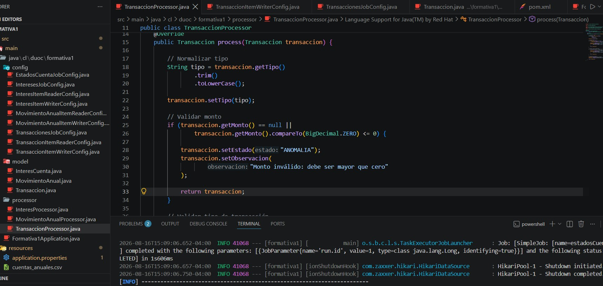
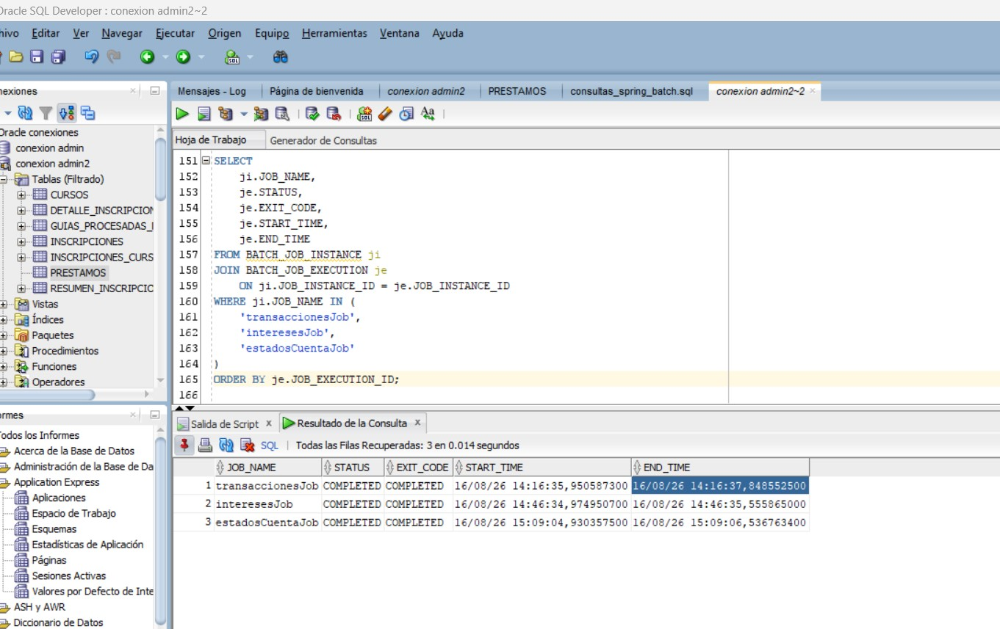

# Banco XYZ - Migración de Procesos Batch con Spring Batch

## Descripción del proyecto

Este proyecto corresponde a la modernización de procesos batch de un sistema legacy del Banco XYZ utilizando Spring Batch.

La aplicación procesa información proveniente de archivos CSV, aplica validaciones y reglas de negocio mediante `ItemProcessor`, y finalmente persiste los resultados en una base de datos Oracle Cloud.

Se implementaron tres procesos principales:

1. Procesamiento de transacciones diarias.
2. Cálculo de intereses mensuales.
3. Generación de estados de cuenta anuales.

Cada proceso fue implementado como un Job independiente de Spring Batch.

---

## Tecnologías utilizadas

- Java 17
- Spring Boot 4.1.0
- Spring Batch
- Spring JDBC
- Oracle Autonomous Database
- Oracle Wallet
- Maven
- Visual Studio Code
- Oracle SQL Developer

---

## Spring Initializr

El proyecto fue creado mediante Spring Initializr utilizando Maven, Spring Boot y las dependencias principales de Spring Batch, JDBC API y Oracle Driver. Posteriormente, la versión de Java fue ajustada a Java 17 para mantener compatibilidad con el entorno de desarrollo utilizado.



*Figura 1. Configuración inicial del proyecto y selección de dependencias en Spring Initializr.*

## Arquitectura del proyecto

El proyecto utiliza la arquitectura de procesamiento por lotes de Spring Batch:

```text
Archivo CSV
    ↓
ItemReader
    ↓
ItemProcessor
    ↓
ItemWriter
    ↓
Oracle Database
```

Cada Job contiene un Step basado en procesamiento por chunks.

La estructura principal del proyecto es:

```text
src/main/java/cl/duoc/formativa1
│
├── config
│   ├── TransaccionesJobConfig.java
│   ├── InteresesJobConfig.java
│   ├── EstadosCuentaJobConfig.java
│   ├── TransaccionItemReaderConfig.java
│   ├── TransaccionItemWriterConfig.java
│   ├── InteresItemReaderConfig.java
│   ├── InteresItemWriterConfig.java
│   ├── MovimientoAnualItemReaderConfig.java
│   └── MovimientoAnualItemWriterConfig.java
│
├── model
│   ├── Transaccion.java
│   ├── InteresCuenta.java
│   └── MovimientoAnual.java
│
├── processor
│   ├── TransaccionProcessor.java
│   ├── InteresProcessor.java
│   └── MovimientoAnualProcessor.java
│
└── Formativa1Application.java
```

Los archivos utilizados como entrada se encuentran en:

```text
src/main/resources
├── transacciones.csv
├── intereses.csv
├── cuentas_anuales.csv
├── application.properties
└── schema.sql
```

### Evidencia de la estructura del proyecto

La siguiente captura muestra la organización del proyecto en Visual Studio Code, incluyendo los paquetes `config`, `model` y `processor`, además de los archivos CSV y la configuración en `resources`.



---

# Jobs implementados

## 1. transaccionesJob

Procesa el archivo:

```text
transacciones.csv
```

El objetivo de este Job es procesar las transacciones diarias del banco, detectar anomalías y generar un resumen diario.

### Flujo

```text
transacciones.csv
        ↓
transaccionReader
        ↓
TransaccionProcessor
        ↓
transaccionWriter
        ↓
Oracle
```

### Validaciones

Una transacción es considerada anómala cuando:

- El monto es igual a cero.
- El monto es menor que cero.
- El tipo de transacción no corresponde a `debito` o `credito`.

Los registros incorrectos no se eliminan. Se almacenan indicando:

```text
ESTADO = ANOMALIA
```

junto con una observación que explica el problema detectado.

### Tablas utilizadas

```text
TRANSACCIONES_PROCESADAS
RESUMEN_TRANSACCIONES_DIARIAS
```

`TRANSACCIONES_PROCESADAS` almacena cada transacción junto con el resultado de su validación.

`RESUMEN_TRANSACCIONES_DIARIAS` contiene información agregada por fecha, incluyendo:

- Total de transacciones.
- Total de créditos.
- Total de débitos.
- Total de anomalías.
- Monto de créditos.
- Monto de débitos.

### Evidencia de transacciones y anomalías

La siguiente captura muestra las 10 transacciones procesadas y las dos anomalías detectadas para los registros con montos menores o iguales a cero.



---

## 2. interesesJob

Procesa el archivo:

```text
intereses.csv
```

El objetivo es calcular los intereses mensuales correspondientes a cuentas de ahorro y préstamos, obteniendo un nuevo saldo final.

### Flujo

```text
intereses.csv
       ↓
interesReader
       ↓
InteresProcessor
       ↓
interesWriter
       ↓
Oracle
```

### Tasas utilizadas

Para la implementación se definieron las siguientes tasas de interés:

| Tipo de cuenta | Tasa |
|---|---:|
| Ahorro | 1% |
| Préstamo | 2% |

Estas tasas fueron definidas como parte de la propuesta técnica del proyecto, debido a que los archivos e instrucciones del caso no especifican una tasa determinada.

### Cálculo

```text
Interés = Saldo inicial × Tasa
Saldo final = Saldo inicial + Interés
```

Ejemplo:

```text
Saldo inicial = 5000
Tipo = ahorro
Tasa = 1%

Interés = 50
Saldo final = 5050
```

### Validaciones

Se considera una anomalía cuando:

- El saldo es igual o menor que cero.
- El tipo de cuenta no corresponde a `ahorro` o `prestamo`.

Por ejemplo, una cuenta clasificada como `hipoteca` es registrada como anomalía debido a que este proceso se encuentra definido para cuentas de ahorro y préstamos.

### Tabla utilizada

```text
INTERESES_CALCULADOS
```

Esta tabla almacena:

- Cuenta.
- Nombre.
- Saldo inicial.
- Tipo.
- Tasa aplicada.
- Interés calculado.
- Saldo final.
- Estado.
- Observación.

### Evidencia del cálculo de intereses

La siguiente captura muestra las tasas aplicadas, los intereses calculados, los saldos finales y las anomalías detectadas.



---

## 3. estadosCuentaJob

Procesa el archivo:

```text
cuentas_anuales.csv
```

El objetivo es procesar los movimientos realizados durante el año y generar un resumen por cuenta que pueda ser utilizado como estado de cuenta y apoyo para auditoría.

### Flujo

```text
cuentas_anuales.csv
          ↓
movimientoAnualReader
          ↓
MovimientoAnualProcessor
          ↓
movimientoAnualWriter
          ↓
Oracle
```

### Reglas de validación

Se utilizaron las siguientes reglas:

- Un depósito debe tener un monto positivo.
- Un retiro debe tener un monto negativo.
- Una compra debe tener un monto negativo.
- Un movimiento con monto cero se considera anomalía.
- Un tipo de movimiento desconocido se considera anomalía.

Los valores negativos de retiros y compras no se consideran errores, ya que representan una salida de dinero desde la cuenta.

### Tablas utilizadas

```text
MOVIMIENTOS_ANUALES
ESTADOS_CUENTA_ANUALES
```

`MOVIMIENTOS_ANUALES` almacena todos los movimientos procesados.

`ESTADOS_CUENTA_ANUALES` genera un resumen por cuenta con:

- Total de ingresos.
- Total de egresos.
- Saldo neto.
- Cantidad de movimientos.
- Cantidad de anomalías.

Ejemplo:

```text
Cuenta 101

Depósito:  +1000
Retiro:     -500

Total ingresos: 1000
Total egresos:   500
Saldo neto:      500
```

### Evidencia de movimientos anuales

La tabla `MOVIMIENTOS_ANUALES` conserva los movimientos procesados junto con su estado y observación.



### Evidencia de estados de cuenta anuales

La tabla `ESTADOS_CUENTA_ANUALES` consolida ingresos, egresos, saldo neto, cantidad de movimientos y anomalías por cuenta.



---

# Manejo de errores

Los Jobs utilizan procesamiento tolerante a fallos mediante Spring Batch:

```java
.faultTolerant()
.skip(Exception.class)
.skipLimit(10)
```


Esto permite manejar errores técnicos durante el procesamiento sin detener inmediatamente todo el Job.

Además, las reglas de negocio son manejadas principalmente dentro de los `ItemProcessor`.

Cuando se encuentra información incorrecta, el registro es almacenado con:

```text
ESTADO = ANOMALIA
```

y una descripción del problema en el campo:

```text
OBSERVACION
```

De esta forma se conserva el registro original y existe trazabilidad sobre la anomalía detectada.

Otras capturas de manejos de errores:





---

# Persistencia

La aplicación utiliza Oracle Autonomous Database.

Spring JDBC se utiliza para persistir los datos procesados.

Además, Spring Batch utiliza sus tablas internas para mantener información sobre las ejecuciones:

```text
BATCH_JOB_INSTANCE
BATCH_JOB_EXECUTION
BATCH_JOB_EXECUTION_PARAMS
BATCH_STEP_EXECUTION
BATCH_STEP_EXECUTION_CONTEXT
BATCH_JOB_EXECUTION_CONTEXT
```

Estas tablas permiten mantener un historial de las ejecuciones de los Jobs.

---

# Configuración de Oracle

La conexión se configura desde:

```text
src/main/resources/application.properties
```

Ejemplo:

```properties
spring.datasource.url=jdbc:oracle:thin:@plataformaatp_high?TNS_ADMIN=C:/oracle
spring.datasource.username=ADMIN
spring.datasource.password=TU_PASSWORD
spring.datasource.driver-class-name=oracle.jdbc.OracleDriver
```

El Oracle Wallet debe encontrarse en la ruta configurada mediante `TNS_ADMIN`.

Por seguridad, las credenciales reales de acceso a la base de datos no deben publicarse en un repositorio público.

---

# Configuración de Spring Batch

Se utiliza el repositorio JDBC de Spring Batch:

```properties
spring.batch.jdbc.initialize-schema=always
spring.batch.jdbc.platform=oracle
spring.batch.jdbc.isolation-level-for-create=READ_COMMITTED
```

Una vez creadas las tablas de la aplicación, para evitar recrearlas durante las siguientes ejecuciones se utiliza:

```properties
spring.sql.init.mode=never
```

---

# Ejecución del proyecto

Desde una terminal ubicada en la raíz del proyecto ejecutar:

```bash
mvn clean spring-boot:run
```

El Job a ejecutar se selecciona desde `application.properties`.

---

## Ejecutar transaccionesJob

```properties
app.input-file=classpath:transacciones.csv
spring.batch.job.name=transaccionesJob
```

Luego:

```bash
mvn clean spring-boot:run
```

---

## Ejecutar interesesJob

Cambiar las propiedades a:

```properties
app.input-file=classpath:intereses.csv
spring.batch.job.name=interesesJob
```

Luego:

```bash
mvn clean spring-boot:run
```

---

## Ejecutar estadosCuentaJob

Cambiar las propiedades a:

```properties
app.input-file=classpath:cuentas_anuales.csv
spring.batch.job.name=estadosCuentaJob
```

Luego:

```bash
mvn clean spring-boot:run
```

Una ejecución correcta debe finalizar con:

```text
status: [COMPLETED]
```

---

# Verificación de los Jobs

Para comprobar las ejecuciones registradas por Spring Batch:

```sql
SELECT
    ji.JOB_NAME,
    je.STATUS,
    je.EXIT_CODE,
    je.START_TIME,
    je.END_TIME
FROM BATCH_JOB_INSTANCE ji
JOIN BATCH_JOB_EXECUTION je
    ON ji.JOB_INSTANCE_ID = je.JOB_INSTANCE_ID
WHERE ji.JOB_NAME IN (
    'transaccionesJob',
    'interesesJob',
    'estadosCuentaJob'
)
ORDER BY je.JOB_EXECUTION_ID;
```

Durante las pruebas se verificó la ejecución correcta de:

```text
transaccionesJob   COMPLETED
interesesJob       COMPLETED
estadosCuentaJob   COMPLETED
```

### Evidencia de ejecución

La siguiente captura de Oracle SQL Developer confirma que los tres Jobs finalizaron con estado `COMPLETED`.



---

# Consultas de comprobación

## Transacciones procesadas

```sql
SELECT
    ID,
    FECHA,
    MONTO,
    TIPO,
    ESTADO,
    OBSERVACION
FROM TRANSACCIONES_PROCESADAS
ORDER BY ID;
```

## Resumen diario

```sql
SELECT *
FROM RESUMEN_TRANSACCIONES_DIARIAS
ORDER BY FECHA;
```

## Intereses calculados

```sql
SELECT
    CUENTA_ID,
    NOMBRE,
    SALDO_INICIAL,
    TIPO,
    TASA_INTERES,
    INTERES_CALCULADO,
    SALDO_FINAL,
    ESTADO
FROM INTERESES_CALCULADOS
ORDER BY CUENTA_ID;
```

## Movimientos anuales

```sql
SELECT
    CUENTA_ID,
    FECHA,
    TRANSACCION,
    MONTO,
    ESTADO,
    OBSERVACION
FROM MOVIMIENTOS_ANUALES
ORDER BY CUENTA_ID, FECHA;
```

## Estados de cuenta anuales

```sql
SELECT
    CUENTA_ID,
    TOTAL_INGRESOS,
    TOTAL_EGRESOS,
    SALDO_NETO,
    CANTIDAD_MOVIMIENTOS,
    CANTIDAD_ANOMALIAS
FROM ESTADOS_CUENTA_ANUALES
ORDER BY CUENTA_ID;
```

---

# Resultados obtenidos

Los tres procesos Batch fueron ejecutados correctamente:

```text
transaccionesJob  → COMPLETED
interesesJob      → COMPLETED
estadosCuentaJob  → COMPLETED
```

El sistema permite:

- Leer información desde archivos CSV.
- Procesar datos mediante Spring Batch.
- Aplicar transformaciones y reglas de validación.
- Detectar y registrar anomalías.
- Calcular intereses.
- Generar resúmenes diarios.
- Generar estados de cuenta anuales.
- Persistir resultados en Oracle Cloud.
- Mantener el historial de ejecuciones mediante JobRepository.

---

# Evidencias

Las capturas de ejecución se encuentran en la carpeta:

```text
evidencias/
```

Incluyen:

```text
01_estructura_proyecto.jpg
02_jobs_completed.jpg
03_transacciones_anomalias.jpg
04_intereses_calculados.jpg
05_movimientos_anuales.jpg
06_estados_cuenta_anuales.jpg
```

Las evidencias se encuentran también insertadas en las secciones correspondientes de este README para facilitar la revisión del proyecto.

---

## Conclusión

La implementación permitió migrar los tres procesos principales del sistema legacy del Banco XYZ a una arquitectura basada en Spring Batch.

La solución separa la lectura, procesamiento y escritura de información mediante `ItemReader`, `ItemProcessor` e `ItemWriter`, permitiendo aplicar reglas de validación y mantener los resultados almacenados en Oracle.

Además, el uso del JobRepository de Spring Batch permite mantener un registro de las ejecuciones realizadas, facilitando el seguimiento y control de los procesos batch.