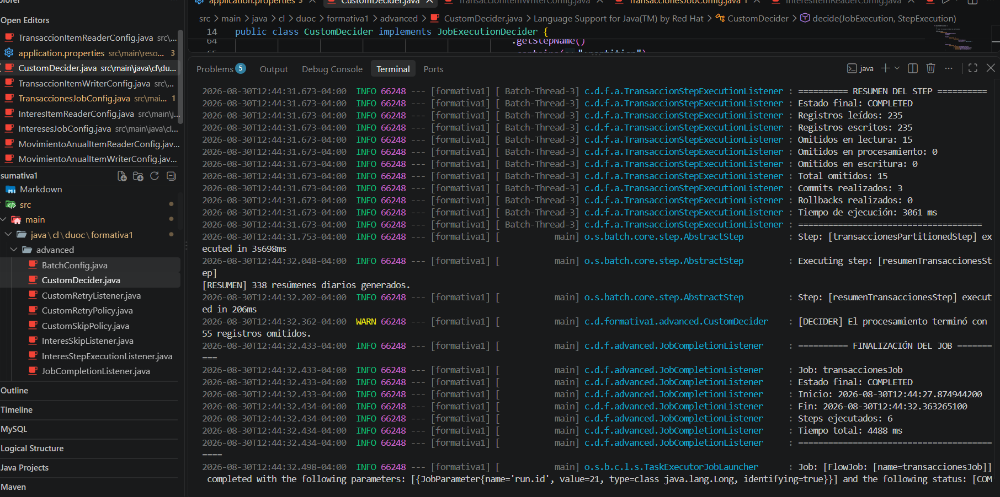
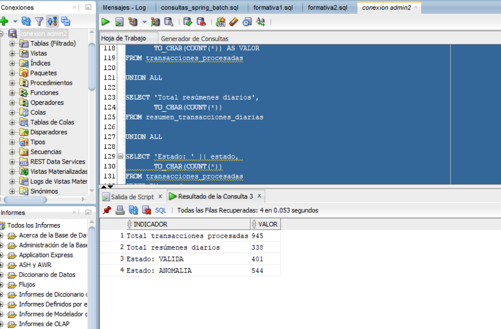
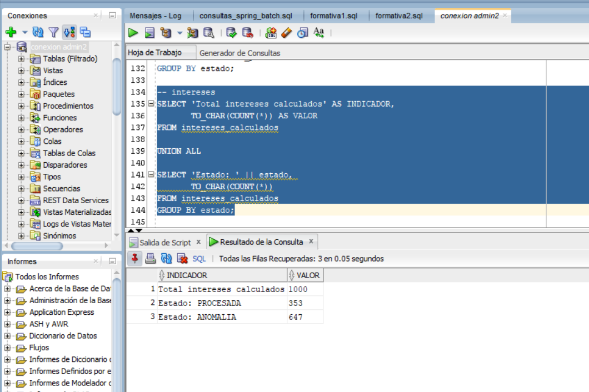
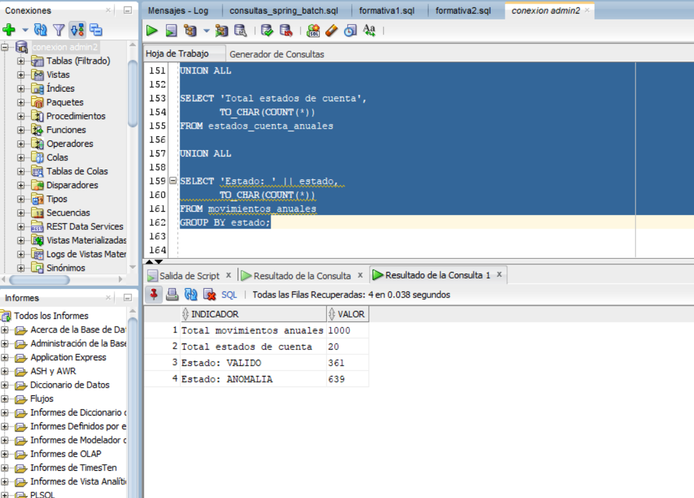
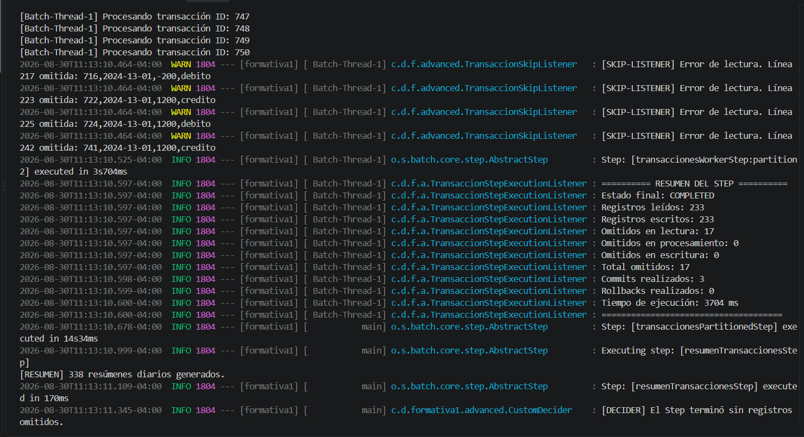
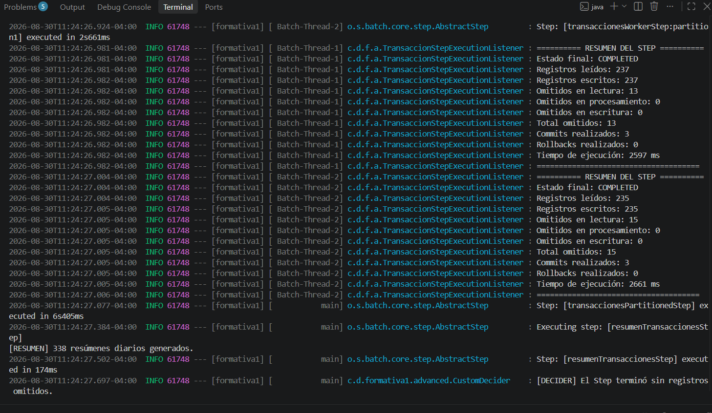
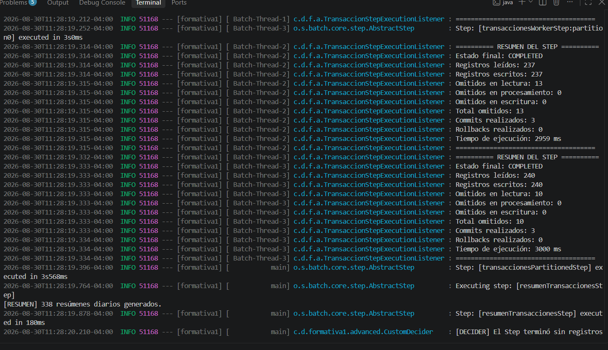
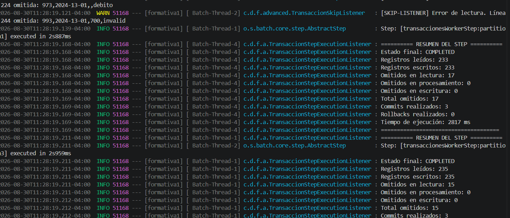

# Sumativa - Semana 3

# Banco XYZ - Optimización y resiliencia de procesos Batch con Spring Batch

## Descripción del proyecto

Este proyecto corresponde a la modernización de procesos batch de un sistema legacy del **Banco XYZ** mediante **Spring Batch**.

La aplicación procesa información proveniente de archivos CSV, aplica transformaciones y reglas de validación mediante `ItemProcessor`, maneja errores mediante políticas de tolerancia a fallos y persiste los resultados en **Oracle Autonomous Database**.

Durante la Semana 3 el proyecto fue ampliado para incorporar **particionamiento**, procesamiento paralelo mediante `TaskExecutorPartitionHandler`, políticas de `skip` y `retry`, listeners de monitoreo, un `CustomDecider` y pruebas de rendimiento con distintas cantidades de hilos.

Se implementaron tres procesos principales:

1. **Reporte de transacciones diarias**.
2. **Cálculo de intereses mensuales**.
3. **Generación de estados de cuenta anuales**.

Cada proceso fue implementado como un `Job` independiente de Spring Batch.

---

## Tecnologías utilizadas

- Java 17
- Spring Boot 4.1.0
- Spring Batch 6
- Spring JDBC
- Oracle Autonomous Database
- Oracle Wallet
- Maven
- Visual Studio Code
- Oracle SQL Developer
- Git y GitHub

---

## Objetivo

Migrar y optimizar tres procesos batch del sistema legacy del Banco XYZ mediante una solución que permita:

- Leer información desde archivos CSV.
- Procesar y validar datos mediante `ItemProcessor`.
- Detectar registros mal formados y anomalías de negocio.
- Persistir resultados en Oracle Autonomous Database.
- Procesar información mediante chunks.
- Dividir los archivos de entrada en particiones.
- Ejecutar particiones en paralelo mediante múltiples hilos.
- Aplicar políticas de `skip`, `retry` y espera entre reintentos.
- Registrar métricas, errores, commits, rollbacks y tiempos de ejecución.
- Evaluar los registros omitidos mediante un `CustomDecider`.
- Comparar distintas configuraciones de escalamiento para seleccionar la más eficiente.
- Mantener trazabilidad mediante el `JobRepository` de Spring Batch.

---

# Arquitectura general

La solución utiliza una arquitectura **Manager / Worker** con particionamiento.

```text
                         JOB
                          │
                          ▼
                 Partitioned Step
                          │
                          ▼
                MultiResourcePartitioner
                          │
              ┌───────────┼───────────┐
              │           │           │
              ▼           ▼           ▼
         partition0   partition1   partition2   partition3
              │           │           │           │
              └───────────┴─────┬─────┴───────────┘
                                ▼
                    TaskExecutorPartitionHandler
                                │
                                ▼
                       ThreadPoolTaskExecutor
                                │
                 ┌──────────────┼──────────────┐
                 ▼              ▼              ▼
           Worker Step     Worker Step     Worker Step
                 │
                 ▼
       ItemReader → ItemProcessor → ItemWriter
                 │
                 ▼
           Oracle Database
```

Cada Worker procesa un archivo físico independiente y utiliza un chunk de **100 registros**.

La configuración final utiliza:

```properties
app.partition.grid-size=4
app.partition.threads=4
```

El `ThreadPoolTaskExecutor` está configurado con cuatro hilos de trabajo y una cola de capacidad 10.

---

# Estructura del proyecto

```text
src/main/java/cl/duoc/formativa1
│
├── advanced
│   ├── BatchConfig.java
│   ├── CustomDecider.java
│   ├── CustomRetryListener.java
│   ├── CustomRetryPolicy.java
│   ├── CustomSkipPolicy.java
│   ├── InteresSkipListener.java
│   ├── InteresStepExecutionListener.java
│   ├── JobCompletionListener.java
│   ├── MovimientoAnualSkipListener.java
│   ├── MovimientoAnualStepExecutionListener.java
│   ├── TransaccionSkipListener.java
│   └── TransaccionStepExecutionListener.java
│
├── business
│   ├── InteresCuenta.java
│   ├── MovimientoAnual.java
│   └── Transaccion.java
│
├── items
│   ├── InteresItemReaderConfig.java
│   ├── InteresItemWriterConfig.java
│   ├── InteresProcessor.java
│   ├── MovimientoAnualItemReaderConfig.java
│   ├── MovimientoAnualItemWriterConfig.java
│   ├── MovimientoAnualProcessor.java
│   ├── TransaccionItemReaderConfig.java
│   ├── TransaccionItemWriterConfig.java
│   └── TransaccionProcessor.java
│
├── jobs
│   ├── EstadosCuentaJobConfig.java
│   ├── InteresesJobConfig.java
│   └── TransaccionesJobConfig.java
│
└── Formativa1Application.java
```

Recursos principales:

```text
src/main/resources
├── application.properties
├── schema.sql
├── transacciones.csv
├── transacciones-00.csv
├── transacciones-01.csv
├── transacciones-02.csv
├── transacciones-03.csv
├── intereses.csv
├── intereses-00.csv
├── intereses-01.csv
├── intereses-02.csv
├── intereses-03.csv
├── cuentas_anuales.csv
├── cuentas_anuales-00.csv
├── cuentas_anuales-01.csv
├── cuentas_anuales-02.csv
└── cuentas_anuales-03.csv
```

Las capturas utilizadas como evidencia se encuentran en:

```text
Markdown/
```

---

# Jobs implementados

## 1. transaccionesJob

Procesa las transacciones diarias, detecta anomalías y genera un resumen consolidado por fecha.

### Flujo

```text
transacciones-00.csv ─┐
transacciones-01.csv ─┤
transacciones-02.csv ─┼─→ MultiResourcePartitioner
transacciones-03.csv ─┘
                            ↓
                  transaccionesWorkerStep
                            ↓
           Reader → Processor → Writer
                            ↓
               TRANSACCIONES_PROCESADAS
                            ↓
               resumenTransaccionesStep
                            ↓
          RESUMEN_TRANSACCIONES_DIARIAS
                            ↓
                     CustomDecider
```

### Validaciones

Una transacción se registra como anomalía cuando:

- El monto es igual o menor que cero.
- El tipo de transacción no corresponde a `debito` o `credito`.

El Reader soporta distintos formatos de fecha válidos. Los registros con fechas imposibles, por ejemplo `2024-13-01`, no pueden ser convertidos y son omitidos mediante la política de `skip`.

Los registros que sí pueden leerse, pero incumplen reglas de negocio, **no se descartan**: se almacenan con `ESTADO = ANOMALIA` y una descripción en `OBSERVACION`.

### Resultado final

- Registros de entrada: **1000**.
- Registros procesados y persistidos: **945**.
- Registros omitidos por fecha/formato inválido: **55**.
- Resúmenes diarios generados: **338**.
- Registros `VALIDA`: **401**.
- Registros `ANOMALIA`: **544**.

### Tablas utilizadas

```text
TRANSACCIONES_PROCESADAS
RESUMEN_TRANSACCIONES_DIARIAS
```

El resumen se genera en un Step secuencial posterior al procesamiento particionado. De esta manera se evita que varias particiones actualicen simultáneamente las mismas filas del resumen.

---

## 2. interesesJob

Procesa los registros de cuentas para calcular intereses mensuales y persistir el saldo final.

### Flujo

```text
intereses-00.csv ─┐
intereses-01.csv ─┤
intereses-02.csv ─┼─→ MultiResourcePartitioner
intereses-03.csv ─┘
                       ↓
              interesesWorkerStep
                       ↓
        Reader → Processor → Writer
                       ↓
            INTERESES_CALCULADOS
                       ↓
                CustomDecider
```

### Tasas utilizadas

| Tipo de cuenta | Tasa |
|---|---:|
| Ahorro | 1% |
| Préstamo | 2% |

### Cálculo

```text
Interés = Saldo inicial × Tasa
Saldo final = Saldo inicial + Interés
```

### Validaciones

Una cuenta se registra como anomalía cuando:

- El saldo es igual o menor que cero.
- El tipo de cuenta no corresponde a `ahorro` o `prestamo`.

Los saldos vacíos se convierten a cero y las edades vacías se manejan como valor nulo antes de aplicar las reglas de negocio.

La tabla `INTERESES_CALCULADOS` utiliza una clave técnica `ID_CALCULO` autogenerada, ya que el archivo de origen puede contener múltiples registros correspondientes a la misma `CUENTA_ID`.

### Resultado final

- Registros de entrada: **1000**.
- Registros persistidos: **1000**.
- Registros `PROCESADA`: **353**.
- Registros `ANOMALIA`: **647**.

---

## 3. estadosCuentaJob

Procesa movimientos anuales y genera posteriormente un estado consolidado por cuenta.

### Flujo

```text
cuentas_anuales-00.csv ─┐
cuentas_anuales-01.csv ─┤
cuentas_anuales-02.csv ─┼─→ MultiResourcePartitioner
cuentas_anuales-03.csv ─┘
                             ↓
                    movimientosWorkerStep
                             ↓
              Reader → Processor → Writer
                             ↓
                   MOVIMIENTOS_ANUALES
                             ↓
                generarEstadosCuentaStep
                             ↓
                ESTADOS_CUENTA_ANUALES
                             ↓
                      CustomDecider
```

### Reglas de validación

- Un depósito debe tener un monto positivo.
- Un retiro debe tener un monto negativo.
- Una compra debe tener un monto negativo.
- Un movimiento con monto cero se registra como anomalía.
- Un tipo de movimiento desconocido se registra como anomalía.

Los valores negativos de retiros y compras representan salidas de dinero y no se consideran errores cuando cumplen la regla correspondiente.

### Resultado final

- Movimientos de entrada: **1000**.
- Movimientos persistidos: **1000**.
- Estados de cuenta generados: **20**.
- Movimientos `VALIDO`: **361**.
- Movimientos `ANOMALIA`: **639**.

### Tablas utilizadas

```text
MOVIMIENTOS_ANUALES
ESTADOS_CUENTA_ANUALES
```

Al igual que en el Job de transacciones, el consolidado anual se genera en un Step secuencial posterior a las particiones para evitar conflictos de concurrencia sobre la misma cuenta.

---

# Particionamiento y procesamiento paralelo

Los tres Jobs utilizan archivos físicos divididos en cuatro partes. Cada Job configura un `MultiResourcePartitioner`, que asigna un archivo a cada partición mediante el `ExecutionContext`.

La ejecución de las particiones se delega a un `TaskExecutorPartitionHandler`, que utiliza el `ThreadPoolTaskExecutor` definido en `BatchConfig`.

Configuración final:

```properties
app.partition.grid-size=4
app.partition.threads=4
```

Tamaño de chunk utilizado por los Worker Steps:

```text
chunk = 100
```

Esta configuración permite procesar las cuatro particiones de forma concurrente.

---

# Comparación de rendimiento

Para determinar una configuración eficiente se realizaron tres ejecuciones del `transaccionesJob`.

En todas las pruebas se mantuvieron constantes:

- 4 archivos físicos de entrada.
- 4 particiones.
- Chunk de 100 registros.

La única variable modificada fue la cantidad de hilos disponibles.

| Prueba | Particiones | Hilos | Chunk | Tiempo del Step particionado |
|---|---:|---:|---:|---:|
| A | 4 | 1 | 100 | 14.034 ms |
| B | 4 | 2 | 100 | 6.405 ms |
| C | 4 | 4 | 100 | **3.568 ms** |

Los resultados muestran una reducción importante del tiempo al aumentar la concurrencia. Por esta razón se seleccionó como configuración final:

```properties
app.partition.grid-size=4
app.partition.threads=4
```

> Nota: los tiempos pueden variar entre ejecuciones debido al acceso a Oracle Autonomous Database, carga del equipo y latencia de red. La comparación se realizó manteniendo constantes los archivos y el tamaño del chunk.

---

# Manejo de errores y tolerancia a fallos

La solución diferencia entre **errores de formato** y **anomalías de negocio**.

## Errores de formato

Los errores que impiden convertir correctamente un registro del CSV se manejan mediante políticas de `skip`.

En el proceso de transacciones se consideran, entre otros:

```text
FlatFileParseException
DateTimeParseException
NumberFormatException
```

De esta forma un registro mal formado puede ser omitido sin detener completamente el Job.

Los listeners de skip registran la línea y el contenido problemático para mantener trazabilidad.

## Anomalías de negocio

Un registro que puede ser leído correctamente pero no cumple las reglas del negocio se conserva en la base de datos con:

```text
ESTADO = ANOMALIA
```

y una descripción en `OBSERVACION`.

Por lo tanto:

```text
Error de formato
      ↓
SkipPolicy
      ↓
Registro omitido

Dato legible pero inválido según negocio
      ↓
ItemProcessor
      ↓
Registro persistido como ANOMALIA
```

---

# Políticas de reintento

La aplicación incorpora políticas de retry para errores transitorios de acceso a datos.

La política personalizada utilizada en los procesos configura:

```text
Máximo de reintentos: 3
Espera entre reintentos: 500 ms
```

En `transaccionesJob` se utiliza además una política con `SimpleRetryPolicy` y `ExponentialBackOffPolicy` para errores transitorios como problemas temporales de bloqueo o acceso a datos.

Configuración del BackOff exponencial:

```text
Intervalo inicial: 1000 ms
Multiplicador: 2
Intervalo máximo: 10000 ms
```

El objetivo es reintentar fallos temporales sin sobrecargar inmediatamente la base de datos.

---

# Listeners y métricas

Cada Worker Step incorpora un `StepExecutionListener` que registra:

- Estado final.
- Registros leídos.
- Registros escritos.
- Omitidos en lectura.
- Omitidos en procesamiento.
- Omitidos en escritura.
- Total de omitidos.
- Commits realizados.
- Rollbacks realizados.
- Tiempo de ejecución.

Listeners implementados:

```text
TransaccionStepExecutionListener
InteresStepExecutionListener
MovimientoAnualStepExecutionListener
```

A nivel de Job se utiliza `JobCompletionListener`, que registra:

```text
Nombre del Job
Estado final
Hora de inicio
Hora de término
Cantidad de Steps
Tiempo total
```

---

# CustomDecider

Los Jobs utilizan `CustomDecider` para evaluar si existieron registros omitidos.

En una ejecución particionada el Decider suma los skips de todas las particiones:

```text
partition0 ─┐
partition1 ─┤
partition2 ─┼─→ total de skips → CustomDecider
partition3 ─┘
```

El Decider devuelve uno de los siguientes estados:

```text
COMPLETED_CLEAN
COMPLETED_WITH_SKIPS
```

En la ejecución final de `transaccionesJob` se contabilizaron correctamente:

```text
55 registros omitidos
```

El Job igualmente terminó con estado `COMPLETED`, ya que los skips corresponden a errores controlados mediante la política de tolerancia a fallos.

---

# Re-ejecución de Jobs

Cada Job utiliza:

```java
new RunIdIncrementer()
```

Esto permite crear nuevas instancias mediante el parámetro `run.id`.

Spring Batch mantiene el historial de las ejecuciones mediante su `JobRepository`.

Para repetir pruebas desde cero se recomienda limpiar las tablas de negocio correspondientes antes de volver a ejecutar cada Job.

### Transacciones

```sql
TRUNCATE TABLE resumen_transacciones_diarias;
TRUNCATE TABLE transacciones_procesadas;
```

### Intereses

```sql
TRUNCATE TABLE intereses_calculados;
```

### Estados de cuenta

```sql
TRUNCATE TABLE estados_cuenta_anuales;
TRUNCATE TABLE movimientos_anuales;
```

No es necesario borrar las tablas internas `BATCH_*` para realizar una nueva ejecución.

---

# Persistencia

La aplicación utiliza **Oracle Autonomous Database** y Spring JDBC.

Tablas de negocio:

```text
TRANSACCIONES_PROCESADAS
RESUMEN_TRANSACCIONES_DIARIAS
INTERESES_CALCULADOS
MOVIMIENTOS_ANUALES
ESTADOS_CUENTA_ANUALES
```

Spring Batch mantiene además tablas internas de metadatos, entre ellas:

```text
BATCH_JOB_INSTANCE
BATCH_JOB_EXECUTION
BATCH_JOB_EXECUTION_PARAMS
BATCH_STEP_EXECUTION
BATCH_STEP_EXECUTION_CONTEXT
BATCH_JOB_EXECUTION_CONTEXT
```

---

# Configuración de Oracle

La conexión se configura desde:

```text
src/main/resources/application.properties
```

Ejemplo:

```properties
spring.datasource.url=jdbc:oracle:thin:@plataformaatp_high?TNS_ADMIN=C:/oracle
spring.datasource.username=ADMIN
spring.datasource.password=${ORACLE_DB_PASSWORD}
spring.datasource.driver-class-name=oracle.jdbc.OracleDriver
```

El Oracle Wallet debe estar disponible en la ruta configurada mediante `TNS_ADMIN`.

La contraseña no se almacena directamente en el repositorio. En PowerShell puede definirse temporalmente mediante:

```powershell
$env:ORACLE_DB_PASSWORD="TU_PASSWORD"
```

---

# Configuración de Spring Batch

```properties
spring.batch.jdbc.initialize-schema=always
spring.batch.jdbc.platform=oracle
spring.batch.jdbc.isolation-level-for-create=READ_COMMITTED
```

Las tablas de negocio no se recrean automáticamente en cada ejecución:

```properties
spring.sql.init.mode=never
```

El archivo `schema.sql` puede utilizarse para inicializar manualmente las tablas cuando sea necesario.

Configuración final de escalamiento:

```properties
app.partition.grid-size=4
app.partition.threads=4
```

---

# Selección del Job

El Job activo se configura desde `application.properties`.

## transaccionesJob

```properties
app.input-file=classpath:transacciones.csv
spring.batch.job.name=transaccionesJob
```

## interesesJob

```properties
app.input-file=classpath:intereses.csv
spring.batch.job.name=interesesJob
```

## estadosCuentaJob

```properties
app.input-file=classpath:cuentas_anuales.csv
spring.batch.job.name=estadosCuentaJob
```

Solo debe quedar activa la configuración correspondiente al Job que se desea ejecutar.

---

# Ejecución del proyecto

## Requisitos

- Java 17.
- Maven.
- Oracle Autonomous Database disponible.
- Oracle Wallet configurado.
- Variable de entorno `ORACLE_DB_PASSWORD`.

Desde PowerShell:

```powershell
$env:ORACLE_DB_PASSWORD="TU_PASSWORD"
```

Compilar:

```powershell
mvn clean compile
```

Ejecutar:

```powershell
mvn spring-boot:run
```

Una ejecución correcta debe finalizar con:

```text
status: [COMPLETED]
```

---

# Consultas de comprobación

## Historial de Jobs

```sql
SELECT
    ji.JOB_NAME,
    je.STATUS,
    je.EXIT_CODE,
    je.START_TIME,
    je.END_TIME
FROM BATCH_JOB_INSTANCE ji
JOIN BATCH_JOB_EXECUTION je
    ON ji.JOB_INSTANCE_ID = je.JOB_INSTANCE_ID
WHERE ji.JOB_NAME IN (
    'transaccionesJob',
    'interesesJob',
    'estadosCuentaJob'
)
ORDER BY je.JOB_EXECUTION_ID;
```

## Resumen de transacciones

```sql
SELECT 'Total transacciones procesadas' AS INDICADOR,
       TO_CHAR(COUNT(*)) AS VALOR
FROM transacciones_procesadas
UNION ALL
SELECT 'Total resúmenes diarios', TO_CHAR(COUNT(*))
FROM resumen_transacciones_diarias
UNION ALL
SELECT 'Estado: ' || estado, TO_CHAR(COUNT(*))
FROM transacciones_procesadas
GROUP BY estado;
```

## Resumen de intereses

```sql
SELECT 'Total intereses calculados' AS INDICADOR,
       TO_CHAR(COUNT(*)) AS VALOR
FROM intereses_calculados
UNION ALL
SELECT 'Estado: ' || estado, TO_CHAR(COUNT(*))
FROM intereses_calculados
GROUP BY estado;
```

## Resumen de estados de cuenta

```sql
SELECT 'Total movimientos anuales' AS INDICADOR,
       TO_CHAR(COUNT(*)) AS VALOR
FROM movimientos_anuales
UNION ALL
SELECT 'Total estados de cuenta', TO_CHAR(COUNT(*))
FROM estados_cuenta_anuales
UNION ALL
SELECT 'Estado: ' || estado, TO_CHAR(COUNT(*))
FROM movimientos_anuales
GROUP BY estado;
```

---

# Evidencias de ejecución

## Reporte de Transacciones Diarias

Durante la ejecución se detectaron registros con fechas inválidas, los cuales fueron omitidos mediante la política de `skip` sin detener el Job.

En la ejecución final el `CustomDecider` contabilizó correctamente **55 registros omitidos**, se generaron **338 resúmenes diarios** y el Job terminó en estado `COMPLETED`.



### Resultado en Oracle



Resultados:

- 945 transacciones procesadas.
- 338 resúmenes diarios.
- 401 registros `VALIDA`.
- 544 registros `ANOMALIA`.

---

## Cálculo de Intereses Mensuales

### Resultado en Oracle



Resultados:

- 1000 registros procesados.
- 353 registros `PROCESADA`.
- 647 registros `ANOMALIA`.

---

## Generación de Estados de Cuenta Anuales

### Resultado en Oracle



Resultados:

- 1000 movimientos anuales.
- 20 estados de cuenta generados.
- 361 movimientos `VALIDO`.
- 639 movimientos `ANOMALIA`.

---

# Evidencias de pruebas de rendimiento

## Prueba A - 4 particiones / 1 hilo

```properties
app.partition.grid-size=4
app.partition.threads=1
```



Tiempo del Step particionado: **14.034 ms**.

---

## Prueba B - 4 particiones / 2 hilos

```properties
app.partition.grid-size=4
app.partition.threads=2
```



Tiempo del Step particionado: **6.405 ms**.

---

## Prueba C - 4 particiones / 4 hilos

```properties
app.partition.grid-size=4
app.partition.threads=4
```



La siguiente captura muestra la utilización de `Batch-Thread-4` durante el procesamiento:



Tiempo del Step particionado: **3.568 ms**.

La prueba con cuatro hilos obtuvo el menor tiempo y fue seleccionada como configuración final.

---

# Propuesta técnica

Las principales decisiones técnicas fueron:

- Mantener un Job independiente para cada proceso del Banco XYZ.
- Utilizar cuatro archivos físicos para cada conjunto de datos.
- Implementar particionamiento mediante `MultiResourcePartitioner`.
- Ejecutar las particiones mediante `TaskExecutorPartitionHandler`.
- Utilizar chunks de tamaño 100 en los Worker Steps.
- Comparar 1, 2 y 4 hilos antes de seleccionar la configuración final.
- Mantener cuatro hilos como configuración óptima observada en las pruebas.
- Generar los resúmenes de Transacciones y Estados de Cuenta en Steps secuenciales posteriores para evitar conflictos concurrentes.
- Persistir resultados mediante Spring JDBC y Oracle Autonomous Database.
- Diferenciar errores de formato y anomalías de negocio.
- Implementar políticas personalizadas de `skip` y `retry`.
- Aplicar BackOff exponencial ante fallos transitorios en el proceso de transacciones.
- Incorporar listeners para trazabilidad y métricas.
- Utilizar un `CustomDecider` capaz de sumar los skips de todas las particiones.
- Mantener historial de ejecución mediante `JobRepository`.
- Evitar almacenar credenciales reales dentro del repositorio.

---

# Conclusión

La implementación permitió modernizar los tres procesos principales del sistema legacy del Banco XYZ mediante Spring Batch.

La solución utiliza `ItemReader`, `ItemProcessor` e `ItemWriter` para separar las responsabilidades del procesamiento e incorpora una arquitectura particionada Manager / Worker para ejecutar los archivos de entrada en paralelo.

Las pruebas realizadas con 1, 2 y 4 hilos permitieron comprobar una mejora progresiva del tiempo de ejecución, seleccionándose finalmente una configuración de **4 particiones, 4 hilos y chunk 100**.

Además, las políticas de `skip`, `retry` y BackOff, junto con los listeners y el `CustomDecider`, permiten manejar registros problemáticos y fallos transitorios sin perder la trazabilidad del proceso. Los resultados son persistidos en Oracle Autonomous Database y cada ejecución queda registrada mediante el `JobRepository` de Spring Batch.
